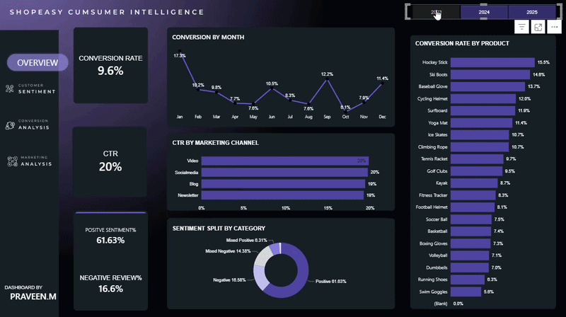
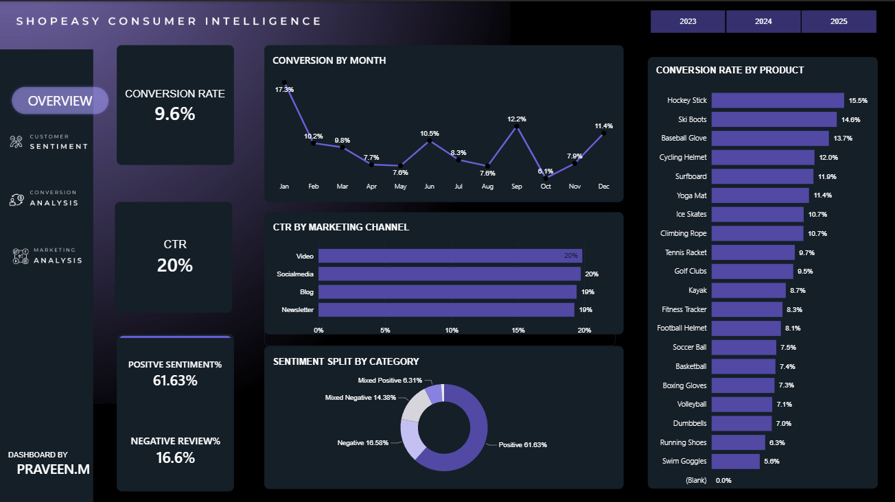
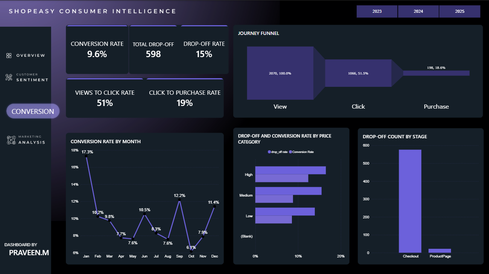
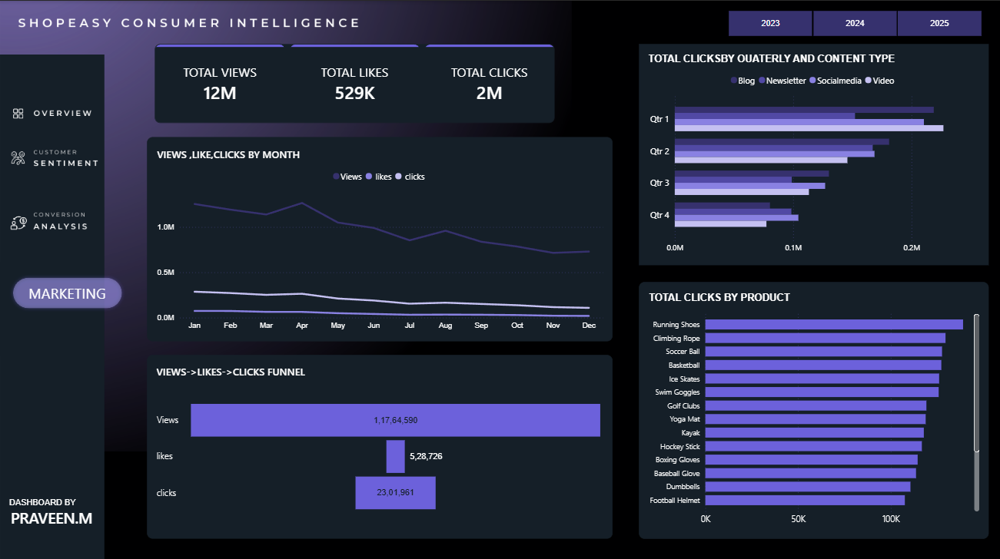
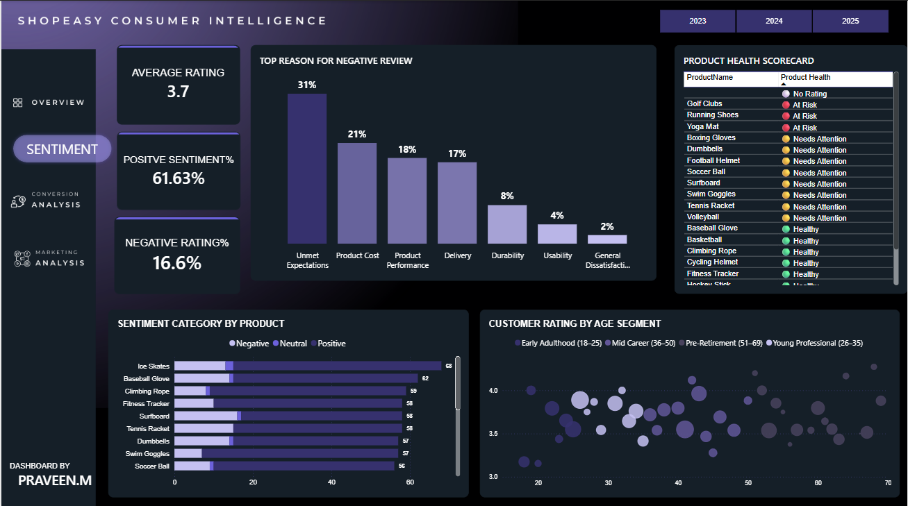

<h3>Dashboard Walkthrough</h3>

<h3>Dashboard Overview</h3>

---

---

---

### Sentiment
- Dissatisfaction is not demographic — no age segment significantly differs in ratings
- Mixed Negative customers (text negative, rating acceptable) represent a hidden churn risk that star ratings alone would miss

---

The SQL files used to validate and clean this data can be found here: [01_validation.sql](01.Data_Validation.sql) · [02_cleaning_transformation.sql](02_cleaning_transformation.sql)

 Power BI dashboard can be found here: [Download Dashboard](shopeasy_consumer_intelligence.pbix)

---

## 🛠️ Tools Used

- **SQL Server** — Data validation, cleaning, and transformation
- **Python** — NLP sentiment pipeline (VADER + keyword theme extraction)
- **Power BI** — Interactive 5-page dashboard with DAX measures and composite scoring

---

